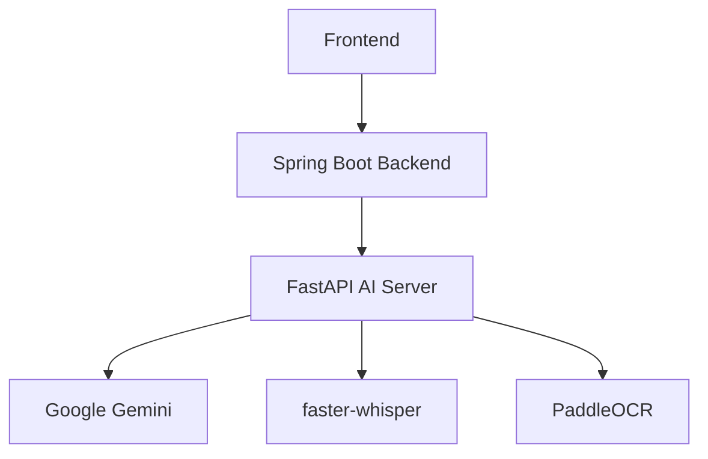
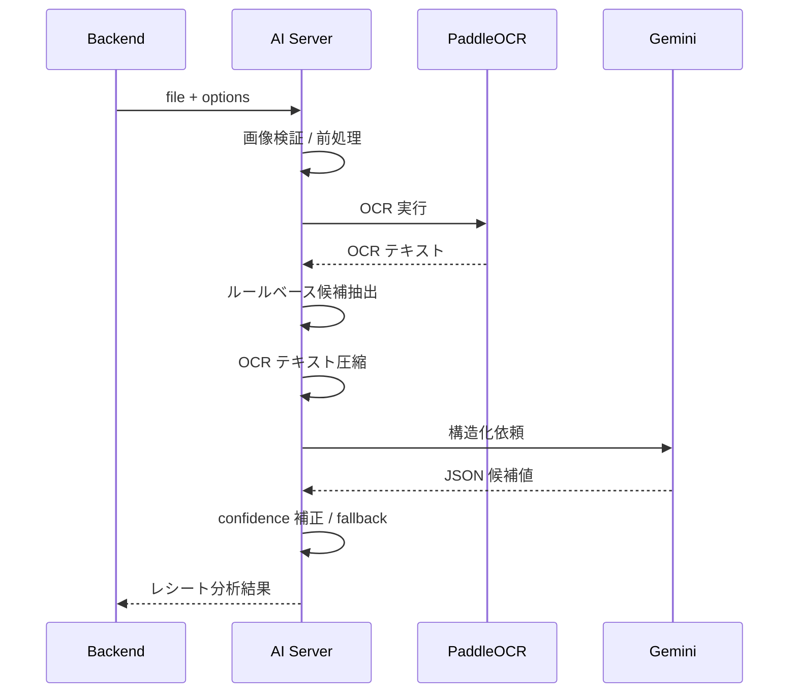

# TranslaCat AI Server

> 翻訳、音声認識、OCR、レシート分析を担当する FastAPI ベースの内部向け AI 処理サーバ

## 1. 概要

TranslaCat AI Server は、TranslaCat プラットフォームにおける AI 専用サービスです。
Spring Boot Backend から分離された構成を採用し、AI モデル依存の処理を独立して扱いやすくしています。

このリポジトリの主な責務は以下の通りです。

- 単文翻訳
- 複数文のバッチ翻訳
- 音声ファイルの文字起こし
- レシート画像 OCR
- レシート内容の取引候補値抽出
- 内部向け API Key 認証
- Gemini を利用した構造化処理
- faster-whisper を利用した STT 処理
- PaddleOCR を利用した画像 OCR 処理

---

## 2. このサーバを分離している理由

AI 処理は、通常の業務 API とは性質が異なります。
モデル依存、計算負荷、再試行制御、音声ファイル処理、画像 OCR 処理など、専用サービスとして切り出した方が管理しやすい要素が多いためです。

TranslaCat では、以下の考え方で責務を分離しています。

- Backend: 認証、業務ロジック、DB、画面向け API、履歴管理、家計簿権限、OCR 設定管理
- AI Server: 翻訳、STT、OCR、AI モデル接続、AI 処理集約

この分離により、AI 処理の改善や置き換えを、業務 API と比較的独立して進めやすくなります。

---

## 3. システム内での位置づけ



AI Server は、原則として Frontend から直接呼び出す前提ではありません。
内部 API として Backend から利用される想定で設計されています。

---

## 4. 主な機能

### 4-1. 単文翻訳

1 つのテキストを受け取り、指定された翻訳ルールに従って翻訳します。
短文 UI 文言、チャット、即時応答が必要なケース向けです。

Endpoint:

```text
POST /api/v1/translate/single
```

Input:

| 項目 | 型 | 説明 |
|---|---|---|
| `text` | string | 翻訳対象の単一テキスト |
| `type` | string | 翻訳ルール切替用タイプ |

Output:

| 項目 | 型 | 説明 |
|---|---|---|
| `translated` | string | 翻訳済み文字列 |

### 4-2. バッチ翻訳

複数テキストをまとめて受け取り、バッチで翻訳します。
Web 小説本文のような長文・大量データを扱うケースを想定しています。

Endpoint:

```text
POST /api/v1/translate/batch
```

Input:

| 項目 | 型 | 説明 |
|---|---|---|
| `texts` | string[] | 翻訳対象文字列配列 |
| `type` | string | 翻訳ルール切替用タイプ |

Output:

| 項目 | 型 | 説明 |
|---|---|---|
| `translated` | string[] | 入力順を維持した翻訳結果配列 |

内部処理の特徴:

- 一定件数ごとに分割して処理
- Chunk 単位の翻訳失敗時は再分割して再試行
- 最終的には 1 文単位での再試行まで実施
- 一部失敗が起きても全体欠損を減らす方向で設計

### 4-3. Speech-to-Text (STT)

アップロードされた音声ファイルを受け取り、文字列へ変換します。

Endpoint:

```text
POST /api/v1/stt/transcribe
```

Input:

| 項目 | 型 | 説明 |
|---|---|---|
| `file` | UploadFile | 音声ファイル |

Output:

| 項目 | 型 | 説明 |
|---|---|---|
| `text` | string | 認識された文字列 |

内部処理の特徴:

- 受信したファイルを一時領域へ保存
- WhisperModel を利用して文字起こし
- 処理後に一時ファイルを削除

### 4-4. レシート分析

アップロードされたレシート画像を OCR で読み取り、家計簿の取引候補値へ構造化します。

Endpoint:

```text
POST /api/v1/account-book/receipts/analyze
```

Input:

| 項目 | 型 | 説明 |
|---|---|---|
| `file` | UploadFile | レシート画像 |
| `options` | JSON string | Backend から渡される OCR / AI 分析オプション |

Output:

| 項目 | 型 | 説明 |
|---|---|---|
| `title` | string / null | 取引名候補 |
| `store_name` | string / null | 店舗名候補 |
| `amount` | integer / null | 合計金額候補 |
| `transaction_date` | string / null | 取引日候補。yyyy-MM-dd |
| `category_name` | string / null | カテゴリ候補 |
| `memo` | string / null | 商品名などのメモ候補 |
| `confidence` | number / null | 分析信頼度 |
| `raw_text` | string / null | OCR 原文 |
| `ocr_engine` | string | OCR エンジン名 |
| `used_ai` | boolean | Gemini 構造化を利用したか |

---

## 5. レシート分析フロー



AI Server は DB に直接アクセスしません。
OCR 言語、通貨コード、キーワード設定は Backend が DB から取得し、`options` として渡します。

---

## 6. レシート分析 options

例:

```json
{
  "currency_code": "JPY",
  "ocr_language": "japan",
  "stop_keywords": ["クレジット売上票", "カード会社", "お客様控え"],
  "important_keywords": ["合計", "税込合計", "TOTAL", "¥"],
  "exclude_item_keywords": ["ください", "キャンペーン", "お知らせ"]
}
```

各項目の意味:

| 項目 | 説明 |
|---|---|
| `currency_code` | 家計簿の基準通貨コード |
| `ocr_language` | PaddleOCR の言語指定 |
| `stop_keywords` | このキーワード以降の OCR 行を除外する |
| `important_keywords` | OCR テキスト圧縮時に保持したい重要キーワード |
| `exclude_item_keywords` | 商品名候補から除外したい広告・案内文キーワード |

`options` が未指定の場合、AI Server 内部の fallback 設定を利用します。

---

## 7. 技術スタック

| 区分 | 採用技術 |
|---|---|
| Language | Python |
| Framework | FastAPI |
| ASGI Server | Uvicorn |
| Validation / Settings | Pydantic, pydantic-settings |
| Translation Model | Google Gemini |
| STT | faster-whisper |
| OCR | PaddleOCR / PaddlePaddle |
| Image Processing | Pillow |

---

## 8. 実装上の見どころ

### 8-1. `type` による翻訳ルール切り替え

翻訳 API は、単純にテキストを送るだけではなく、`type` によって内部プロンプトを切り替える構成です。
用途別に翻訳方針を変えられる柔軟性を持たせています。

### 8-2. バッチ翻訳が単純な一括処理ではない

大量データをそのまま一度に投げるのではなく、Chunk 分割と再試行を組み合わせることで、部分失敗に対して比較的強い設計になっています。

### 8-3. 依存サービスを再利用

`GeminiService`、`STTService`、`OCRService`、`ReceiptAnalysisService` は依存性注入で再利用される形になっており、リクエストごとに重い初期化を避けます。

### 8-4. OCR モデル warm-up

`OCR_WARM_UP=true` の場合、サーバ起動時に OCR モデルを事前ロードし、初回レシート分析時の遅延を抑えます。

### 8-5. AI 失敗時の fallback

Gemini 構造化に失敗した場合でも、OCR から抽出したルールベース候補値で応答します。

---

## 9. セキュリティ

本サーバは API Key ミドルウェアにより保護されています。
対象リクエストには以下のヘッダが必要です。

```http
X-API-KEY: <your-server-api-key>
```

認証対象外パス:

- `/`
- `/docs`
- `/redoc`
- `/openapi.json`

それ以外のエンドポイントに対して API Key が一致しない場合、`401` を返します。

> 本サーバは内部通信用を前提としているため、インターネットへ直接公開する場合は追加のセキュリティ対策が必要です。

---

## 10. API 一覧

| Method | Path | 概要 |
|---|---|---|
| GET | `/` | ルート / 生存確認 |
| POST | `/api/v1/translate/single` | 単文翻訳 |
| POST | `/api/v1/translate/batch` | バッチ翻訳 |
| POST | `/api/v1/stt/transcribe` | 音声文字起こし |
| POST | `/api/v1/account-book/receipts/analyze` | レシート OCR / 取引候補分析 |

---

## 11. 環境変数

本プロジェクトは `.env` ファイルから設定を読み込みます。

| 項目 | 用途 |
|---|---|
| `SERVER_API_KEY` | 内部 API 認証用キー |
| `GOOGLE_API_KEY` | Gemini 利用 API Key |
| `GEMINI_MODEL_NAME` | 使用する Gemini モデル名 |
| `LOG_LEVEL` | root logger のログレベル |
| `APP_LOG_LEVEL` | app logger のログレベル |
| `THIRD_PARTY_LOG_LEVEL` | PaddleOCR / httpx / PIL など外部ライブラリのログレベル |
| `UVICORN_LOG_LEVEL` | uvicorn logger のログレベル |
| `OCR_LANGUAGE` | fallback OCR 言語 |
| `OCR_VERSION` | PaddleOCR バージョン指定 |
| `OCR_WARM_UP` | 起動時 OCR warm-up の有効 / 無効 |
| `OCR_MAX_IMAGE_WIDTH` | OCR 前処理時の最大画像幅 |
| `OCR_IMAGE_QUALITY` | JPEG 変換時の品質 |
| `OCR_MAX_FILE_SIZE` | OCR 受付最大ファイルサイズ |
| `PADDLE_PDX_DISABLE_MODEL_SOURCE_CHECK` | Paddle 関連のモデルソースチェック制御 |

`.env` 例:

```env
SERVER_API_KEY=your-internal-api-key

GOOGLE_API_KEY=your-google-api-key
GEMINI_MODEL_NAME=gemini-2.5-flash

LOG_LEVEL=INFO
APP_LOG_LEVEL=DEBUG
THIRD_PARTY_LOG_LEVEL=WARNING
UVICORN_LOG_LEVEL=INFO

OCR_LANGUAGE=japan
OCR_VERSION=PP-OCRv3
OCR_WARM_UP=true
OCR_MAX_IMAGE_WIDTH=1400
OCR_IMAGE_QUALITY=85
OCR_MAX_FILE_SIZE=5242880

PADDLE_PDX_DISABLE_MODEL_SOURCE_CHECK=true
```

---

## 12. ローカル実行方法

### 12-1. 仮想環境作成

Windows:

```bash
python -m venv .venv
```

macOS / Linux:

```bash
python3 -m venv .venv
```

### 12-2. 仮想環境有効化

Windows:

```bash
.venv\Scripts\activate
```

macOS / Linux:

```bash
source .venv/bin/activate
```

### 12-3. 依存ライブラリインストール

```bash
pip install -r requirements.txt
```

`uv` を利用する場合:

```bash
uv pip install -r requirements.txt
```

PaddleOCR / PaddlePaddle を追加する場合は、環境に合わせて以下を導入します。

```bash
uv pip install paddleocr paddlepaddle pillow opencv-python-headless
```

PaddlePaddle のバージョン差異で OCR 初期化に問題が出る場合は、動作確認済みのバージョンへ固定します。

```bash
uv pip install paddlepaddle==3.2.2
```

### 12-4. サーバ起動

```bash
uvicorn app.main:app --reload
```

必要に応じてホスト / ポート指定:

```bash
uvicorn app.main:app --reload --host 0.0.0.0 --port 8000
```

---

## 13. Swagger / OpenAPI

ローカル起動後、以下で API ドキュメントを確認できます。

```text
Swagger UI: http://localhost:8000/docs
ReDoc:      http://localhost:8000/redoc
```

---

## 14. ディレクトリ構成

```text
app
├─ api
│  ├─ dependencies.py
│  └─ v1
│     ├─ receipt.py
│     ├─ stt.py
│     └─ translate.py
├─ core
│  ├─ config.py
│  ├─ config_logger.py
│  ├─ constants.py
│  ├─ openapi.py
│  ├─ prompts.py
│  ├─ receipt_parser.py
│  └─ utils.py
├─ schemas
│  ├─ receipt.py
│  └─ translation.py
├─ services
│  ├─ gemini_service.py
│  ├─ ocr_service.py
│  ├─ receipt_analysis_service.py
│  └─ stt_service.py
└─ main.py
```

---

## 15. 開発時の注意点

- `SERVER_API_KEY` が未設定だと、認証必須 API を正常に利用できません。
- `GOOGLE_API_KEY` が未設定だと、Gemini を利用する機能は動作しません。
- `GEMINI_MODEL_NAME` は利用可能なモデル名を設定してください。
- `faster-whisper` の初期ロードにより、初回 STT 処理時は応答が遅くなる場合があります。
- OCR モデルの初回ロードにも時間がかかるため、必要に応じて `OCR_WARM_UP=true` を設定します。
- 開発中に `--reload` を使う場合、ファイル保存のたびに warm-up が走る可能性があります。
- レシート画像は Frontend 側で圧縮し、Backend / AI Server のサイズ制限を超えないようにします。
- OCR 結果は画像品質に影響を受けるため、最終的な取引登録前にユーザー確認を行う前提です。

---

## 16. まとめ

TranslaCat AI Server は、翻訳、音声認識、OCR、レシート分析を担当する内部向け AI 処理サーバです。
Backend から切り離すことで責務を明確にし、AI モデル依存処理を独立して改善しやすい構成を実現しています。
