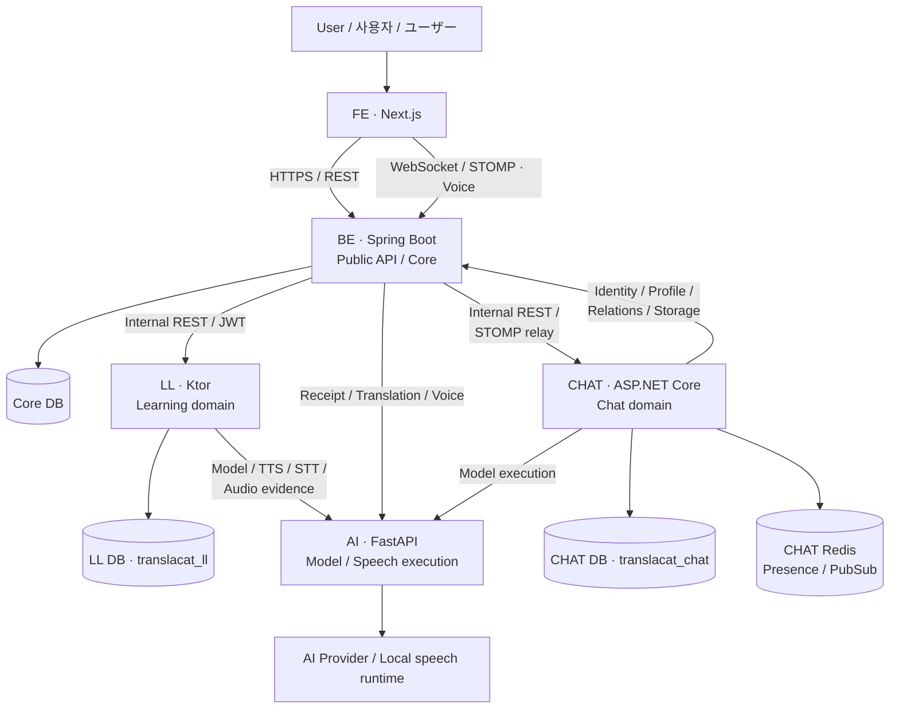
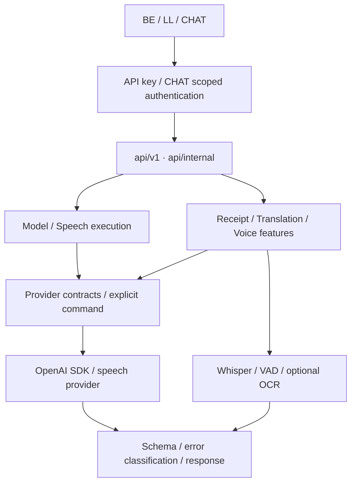
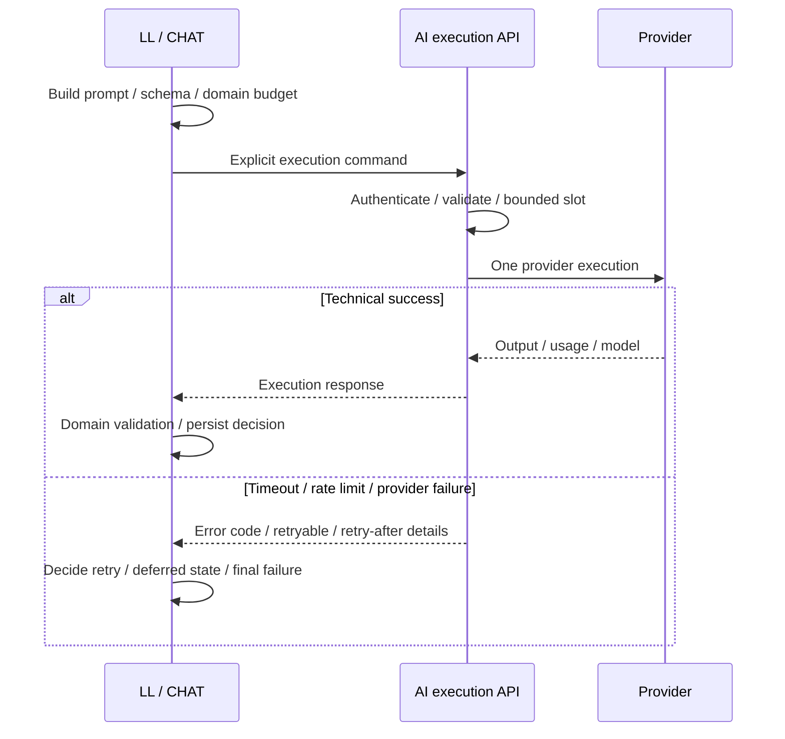
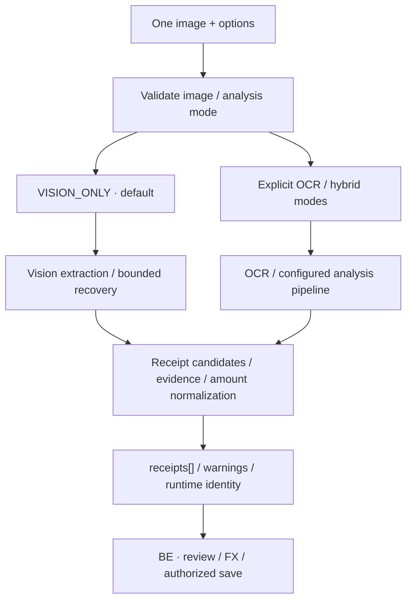
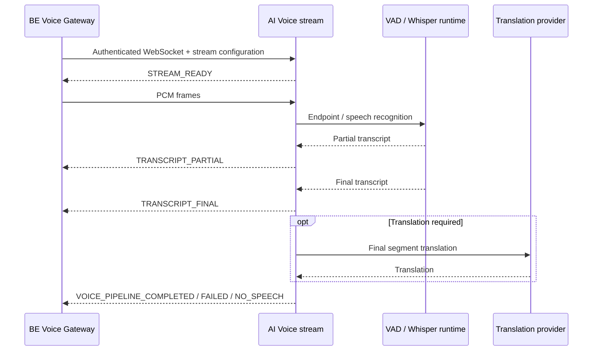

# TranslaCat AI Server

> 범용 모델·음성 실행과 영수증·번역·Voice 파이프라인을 제공하는 FastAPI 내부 서비스  
> 汎用モデル・音声実行とレシート・翻訳・Voiceパイプラインを提供するFastAPI内部サービス

TranslaCat의 FE / BE / AI / CHAT / LL 분리 구조를 설명하는 저장소 안내서입니다. 기술 버전과 경로는 2026-09-27 제공 소스 기준이며, 실행 환경의 실제 배포 상태나 테스트 통과를 의미하지 않습니다.  
TranslaCatのFE / BE / AI / CHAT / LL分離構成を説明するリポジトリガイドです。技術バージョンとパスは2026-09-27提供ソースを基準とし、実環境でのデプロイ状態やテスト成功を示すものではありません。

[개요 / 概要](#overview) · [구조 / 構成](#architecture) · [모델 실행 / モデル実行](#model-execution) · [영수증 / レシート](#receipt) · [실행 / 起動](#setup) · [설정 / 設定](#configuration) · [테스트 / テスト](#tests)

---

<a id="overview"></a>

## 1. 개요 / 概要

TranslaCat AI Server는 Provider SDK, 모델 호출, 음성 추론과 이미지 분석을 HTTP/WebSocket 경계 뒤에 모으는 내부 서비스입니다. BE·LL·CHAT이 필요한 실행을 요청하며, 사용자 계정이나 각 서비스의 업무 DB를 직접 소유하지 않습니다.  
TranslaCat AI ServerはProvider SDK、モデル呼び出し、音声推論と画像解析をHTTP/WebSocket境界の背後に集約する内部サービスです。BE・LL・CHATが必要な実行を要求し、ユーザーアカウントや各サービスの業務DBを直接所有しません。

현재 구조에서는 언어학습의 문제 생성·평가 프롬프트, 난이도·채점 정책과 장기 학습 상태는 LL에, 채팅의 번역·AI 대화 정책과 재시도 상태는 CHAT에 있습니다. AI는 이들 서비스의 명령을 실행하는 범용 API와, BE가 사용하는 영수증·일반 번역·Voice 기능을 제공합니다.  
現在の構成では、言語学習の問題生成・評価プロンプト、難易度・採点方針と長期学習状態はLLに、チャットの翻訳・AI会話方針と再試行状態はCHATにあります。AIは各サービスの命令を実行する汎用APIと、BEが利用するレシート・一般翻訳・Voice機能を提供します。

기존 README의 기능·파이프라인 설명은 유지하되, 제거된 학습 전용 API를 현재 사용 가능한 API로 안내하지 않습니다. 저장소의 기존 파일명인 `Readme.md`를 유지합니다.  
従来のREADMEの機能・パイプライン説明を維持しつつ、撤去済みの学習専用APIを現在利用できるAPIとして案内しません。既存ファイル名の`Readme.md`を維持します。

---

<a id="architecture"></a>

## 2. 시스템에서의 위치와 책임 / システム内での位置付けと責務


```mermaid
flowchart TB
    U["User / 사용자 / ユーザー"] --> FE["FE · Next.js"]
    FE -->|"HTTPS / REST"| BE["BE · Spring Boot<br/>Public API / Core"]
    FE -->|"WebSocket / STOMP · Voice"| BE

    BE --> COREDB[("Core DB")]
    BE -->|"Internal REST / JWT"| LL["LL · Ktor<br/>Learning domain"]
    BE -->|"Receipt / Translation / Voice"| AI["AI · FastAPI<br/>Model / Speech execution"]
    BE -->|"Internal REST /<br/>STOMP relay"| CHAT["CHAT · ASP.NET Core<br/>Chat domain"]

    LL --> LLDB[("LL DB · translacat_ll")]
    LL -->|"Model / TTS / STT /<br/>Audio evidence"| AI
    CHAT -->|"Model execution"| AI
    CHAT --> CHATDB[("CHAT DB · translacat_chat")]
    CHAT --> REDIS[("CHAT Redis<br/>Presence / PubSub")]
    CHAT -->|"Identity / Profile /<br/>Relations / Storage"| BE
    AI --> PROVIDER["AI Provider / Local speech runtime"]
```

DB 상자는 데이터 책임과 논리 catalog를 나타냅니다. 이 그림만으로 서로 다른 물리 DB 서버·배포 호스트·고가용성 구성을 의미하지 않습니다. Storage 및 인증 공급자의 세부 연결은 각 기능 절에서 설명합니다.  
DBの箱はデータ責務と論理catalogを表します。この図だけで別々の物理DBサーバー・配置ホスト・高可用性構成を意味するものではありません。Storageと認証プロバイダーの詳細接続は各機能節で説明します。

| 호출자 / 呼び出し元 | AI에 요청하는 처리 / AIへ依頼する処理 | 호출자가 유지하는 책임 / 呼び出し元が保持する責務 |
| --- | --- | --- |
| BE | 일반 번역·영수증 이미지 분석·Voice 스트림<br/>一般翻訳・レシート画像解析・Voiceストリーム | 인증·접근권한·거래/세션 저장·환율·최종 등록<br/>認証・アクセス権・取引/セッション保存・為替・最終登録 |
| LL | 명시적 모델 실행·TTS·STT·오디오 정규화/근거<br/>明示的モデル実行・TTS・STT・音声正規化/根拠 | 학습 프롬프트·스키마·난이도·점수·재시도·학습 DB<br/>学習プロンプト・schema・難易度・点数・再試行・学習DB |
| CHAT | 범용 모델 실행<br/>汎用モデル実行 | 채팅 프롬프트·대상/문맥 선정·번역/AI 작업 상태·재시도 가능 시각<br/>チャットプロンプト・対象/文脈選択・翻訳/AI処理状態・再試行可能時刻 |

AI 안에 남아 있는 영수증 금액 정규화나 Voice 세그먼트 처리는 해당 실행 기능의 일부입니다. 따라서 “AI에는 아무 정책도 없다”가 아니라, “LL/CHAT의 업무 정책을 AI에서 중복 구현하지 않는다”가 정확한 경계입니다.  
AIに残るレシート金額の正規化やVoiceセグメント処理は、各実行機能の一部です。したがって「AIには一切の方針がない」ではなく、「LL/CHATの業務方針をAIで重複実装しない」が正確な境界です。

**관련 소스 / 関連ソース:** [Application / routers](app/main.py) · [Internal routes](app/api/internal/__init__.py) · [Public-versioned routes](app/api/v1/__init__.py)

---

## 3. 기술 스택 / 技術スタック

| 구분 / 区分 | 선언된 기술 / 宣言された技術 |
| --- | --- |
| Runtime | Python 3.11 · Docker python:3.11-slim |
| API | FastAPI 0.133.1 · Uvicorn 0.41.0 |
| Contracts / Settings | Pydantic 2.12.5 · pydantic-settings 2.13.1 |
| Model SDK | OpenAI · Google GenAI 호환 코드 / Google GenAI互換コード |
| Speech | faster-whisper 1.2.1 · CPU/CUDA 설정 / CPU/CUDA設定 |
| OCR | PaddleOCR 3.7.0 · PaddlePaddle 3.2.2 |
| Image / Audio | Pillow · NumPy · 오디오 변환/분석 도구 / 音声変換・解析ツール |
| Verification | pytest · pytest-asyncio · Ruff · Pyright |

설치 버전은 `requirements.txt`와 `requirements-test.txt`가 기준입니다. Google SDK와 Gemini 관련 파일이 존재해도 신규 요청용 Provider가 Gemini라는 뜻은 아닙니다. 현재 factory는 신규 Gemini 생성을 거부하고 OpenAI 실행 경로를 사용합니다.  
インストールバージョンは`requirements.txt`と`requirements-test.txt`を基準とします。Google SDKやGemini関連ファイルが存在しても、新規リクエストのProviderがGeminiであることを意味しません。現在のfactoryは新規Gemini生成を拒否し、OpenAI実行経路を使用します。

**관련 소스 / 関連ソース:** [Runtime dependencies](requirements.txt) · [Test dependencies](requirements-test.txt) · [Provider factory](app/ai/provider_factory.py) · [API dependencies](app/api/dependencies.py) · [Docker](Dockerfile)

---

## 4. 내부 구조 / 内部構造


```mermaid
flowchart TB
    IN["BE / LL / CHAT"] --> AUTH["API key / CHAT scoped authentication"]
    AUTH --> ROUTE["api/v1 · api/internal"]
    ROUTE --> GENERIC["Model / Speech execution"]
    ROUTE --> FEATURE["Receipt / Translation / Voice features"]
    GENERIC --> PORT["Provider contracts / explicit command"]
    FEATURE --> PORT
    PORT --> SDK["OpenAI SDK / speech provider"]
    FEATURE --> LOCAL["Whisper / VAD / optional OCR"]
    SDK --> OUT["Schema / error classification / response"]
    LOCAL --> OUT
```

HTTP 라우트는 인증된 입력과 오류 응답 경계를 만들고, `features`는 기능별 파이프라인, `ai`는 Provider와 모델 정책, `schemas`는 전송 계약을 담당합니다. `common`은 Provider 실패 분류·재시도 정보 등의 기술 공통 처리를 제공합니다.  
HTTPルートは認証済み入力とエラー応答の境界を作り、`features`は機能別パイプライン、`ai`はProviderとモデル方針、`schemas`は転送契約を担当します。`common`はProvider失敗分類・再試行情報などの技術的共通処理を提供します。

---

<a id="model-execution"></a>

## 5. 범용 모델 실행 계약 / 汎用モデル実行契約

`POST /internal/v1/model/execute`는 호출자가 전달한 instructions·messages·모델 tier·출력 스키마·남은 시간 예산을 사용합니다. 문제를 몇 개 만들지, 어떤 답안을 통과시킬지, 실패 후 어느 단계부터 재개할지는 호출자가 결정합니다.  
`POST /internal/v1/model/execute`は呼び出し元から渡されたinstructions・messages・モデルtier・出力schema・残り時間予算を使用します。問題数、回答の合格判定、失敗後にどの段階から再開するかは呼び出し元が決定します。

| 주요 필드 / 主なフィールド | 계약 / 契約 |
| --- | --- |
| `traceId` | 추적용 식별자 / 追跡用識別子 |
| `instructions`, `messages` | 호출자가 구성한 명령·문맥 / 呼び出し元が組み立てた命令・文脈 |
| `tier`, `reasoningEffort` | 허용 조합: NANO/low · LUNA/none · MINI/low · SOL/high<br/>許可される組み合わせ |
| `maxOutputTokens` | 1–8192 |
| `remainingMilliseconds` | 1–300000; 대기와 실행을 포함한 경계 시간 예산<br/>待機と実行を含む境界時間予算 |
| `maxProviderCalls` | 현재 계약은 1 / 現在の契約は1 |
| `responseSchema`, `schemaName`, `strict` | 호출자 제공 구조화 출력 계약; 조합 검증 적용<br/>呼び出し元の構造化出力契約。組み合わせを検証 |
| Response | output · inputTokens · outputTokens · provider · model · providerCalls |


```mermaid
sequenceDiagram
    participant C as LL / CHAT
    participant A as AI execution API
    participant P as Provider
    C->>C: Build prompt / schema / domain budget
    C->>A: Explicit execution command
    A->>A: Authenticate / validate / bounded slot
    A->>P: One provider execution
    alt Technical success
        P-->>A: Output / usage / model
        A-->>C: Execution response
        C->>C: Domain validation / persist decision
    else Timeout / rate limit / provider failure
        A-->>C: Error code / retryable / retry-after details
        C->>C: Decide retry / deferred state / final failure
    end
```

범용 모델 경계는 요청 크기를 제한하고 worker의 event loop별 semaphore로 동시 실행을 제한합니다. `maxProviderCalls=1`은 하나의 명령에 대한 실행 계약이지, 네트워크 재전송까지 포함한 업무 단위의 전역 exactly-once 보장은 아닙니다. 업무 중복 방지와 재시도 상태는 LL/CHAT의 저장·작업 제어가 담당합니다.  
汎用モデル境界はリクエストサイズを制限し、workerのevent loopごとのsemaphoreで同時実行を制限します。`maxProviderCalls=1`は一つの命令に対する実行契約であり、ネットワーク再送を含む業務単位の全体的なexactly-once保証ではありません。業務の重複防止と再試行状態はLL/CHATの保存・ジョブ制御が担当します。

Provider의 timeout·접속 실패·HTTP 상태·출력 오류를 구분해 전달합니다. Provider가 알려 준 `Retry-After`는 호출자의 재시도 판단 근거이며, AI에서 LL/CHAT의 최종 실패·수락 정책을 대신 결정하지 않습니다.  
Providerのtimeout・接続失敗・HTTP status・出力エラーを区別して返します。Providerからの`Retry-After`は呼び出し元の再試行判断の根拠であり、AIがLL/CHATの最終失敗・受理方針を代わりに決定するものではありません。

**관련 소스 / 関連ソース:** [Execution route](app/api/internal/model_execution.py) · [Request / response schema](app/schemas/model_execution.py) · [Model policy](app/ai/model_policy.py) · [Provider retry metadata](app/common/provider_retry.py)

---

<a id="receipt"></a>

## 6. 영수증 분석 / レシート解析

영수증 분석은 이미지 한 장을 받아 이미지 안의 여러 영수증을 `receipts[]`로 반환합니다. 여러 파일의 업로드·진행 관리와 최종 일괄 저장은 FE/BE가 담당합니다. 분석 결과만으로 거래가 자동 저장되지는 않습니다.  
レシート解析は一枚の画像を受け取り、画像内の複数レシートを`receipts[]`で返します。複数ファイルのアップロード・進行管理と最終一括保存はFE/BEが担当します。解析結果だけで取引が自動保存されることはありません。


```mermaid
flowchart TD
    I["One image + options"] --> V["Validate image / analysis mode"]
    V --> VISION["VISION_ONLY · default"]
    V --> OTHER["Explicit OCR / hybrid modes"]
    VISION --> P["Vision extraction / bounded recovery"]
    OTHER --> O["OCR / configured analysis pipeline"]
    P --> N["Receipt candidates / evidence / amount normalization"]
    O --> N
    N --> R["receipts[] / warnings / runtime identity"]
    R --> BE["BE · review / FX / authorized save"]
```

| 설계 요소 / 設計要素 | 현재 처리 / 現在の処理 |
| --- | --- |
| 분석 모드 / 解析モード | `VISION_ONLY` 기본. `VISION_FIRST`, `OCR_WITH_AI`, `OCR_ONLY`도 명시적 선택 가능<br/>標準は`VISION_ONLY`。他のモードも明示選択可能 |
| 원문 / 原文 | 점포·지점·표기 언어와 근거를 유지; 가계부 언어로 일괄 번역하지 않음<br/>店舗・支店・表記言語と根拠を保持。家計簿言語へ一括翻訳しない |
| 금액 / 金額 | purchase_total·payment_breakdown·cash_tendered·change·book_amount를 분리<br/>購入総額・支払内訳・預り金・釣銭・記帳額を分離 |
| 상태 / 状態 | 검토 상태 READY / NEEDS_REVIEW / EXCLUDED와 읽기 실패·경고를 표현<br/>確認状態READY / NEEDS_REVIEW / EXCLUDEDと読み取り失敗・警告を表現 |
| 통화 / 通貨 | 실제 영수증의 통화 검출과 가계부 기준 통화를 혼동하지 않음<br/>実レシート通貨の検出と家計簿基準通貨を混同しない |
| 카테고리 / カテゴリ | 기존 후보·기본 후보와 추천 근거를 사용<br/>既存候補・標準候補と推奨根拠を使用 |
| 진단 / 診断 | analysis_trace_id · runtime_identity · source fingerprint · provider call count |

`original_amount`는 호환 필드이며 단순 구매 총액과 동일하다고 가정하면 안 됩니다. 결제 내역과 정규화된 `book_amount`, 검토 상태를 함께 해석해야 합니다. 환율 적용·가계부 접근권한·등록 시 revision 검증과 트랜잭션은 BE 경계입니다.  
`original_amount`は互換フィールドであり、単純な購入総額と同じだと仮定できません。支払内訳、正規化された`book_amount`、確認状態を合わせて解釈します。為替適用・家計簿アクセス権・登録時revision検証とトランザクションはBEの境界です。

호환 옵션의 `currency_code`는 실제 통화를 강제하지 않으며, `ocr_language`는 명시적인 OCR 힌트입니다. STOP_AFTER 등 과거 OCR 키워드를 이유로 뒤에 놓인 다른 영수증 전체를 잘라 버리는 설명은 현재 동작과 맞지 않습니다.  
互換optionの`currency_code`は実通貨を強制せず、`ocr_language`は明示的なOCRヒントです。STOP_AFTERなど過去のOCR keywordを理由に、後ろにある別レシート全体を切り捨てる説明は現在の動作と一致しません。

Vision 경로와 OCR 경로의 이미지 한도·초기화 비용은 다릅니다. 기본 VISION_ONLY 운영에서는 OCR warm-up을 비활성화할 수 있으며, 이미지 고해상도 처리·복구 crop·동시 호출에도 각각 상한이 있습니다. README의 설정값은 처리 시간이나 인식 정확도에 대한 실측 보장이 아닙니다.  
Vision経路とOCR経路では画像制限・初期化コストが異なります。標準のVISION_ONLY運用ではOCR warm-upを無効にでき、高解像度画像処理・復旧crop・同時呼び出しにもそれぞれ上限があります。READMEの設定値は処理時間や認識精度の実測保証ではありません。

현재 영수증 Vision 호출은 `RECEIPT_ANALYSIS` 모델 정책을 따릅니다. 요청 모델을 이름만 바꿔 설명하지 말고 `app/ai/model_policy.py`와 실제 응답의 provider/model 정보를 기준으로 확인합니다.  
現在のレシートVision呼び出しは`RECEIPT_ANALYSIS`モデル方針に従います。要求モデルを名前だけ置き換えて説明せず、`app/ai/model_policy.py`と実応答のprovider/model情報を基準に確認します。

**관련 소스 / 関連ソース:** [Receipt route](app/api/v1/receipt.py) · [Receipt contracts](app/schemas/receipt.py) · [Receipt implementation](app/features/receipt) · [Settings](app/core/config.py)

---

## 7. 음성 실행과 Voice Translation V2 / 音声実行とVoice Translation V2

### LL용 범용 음성 실행 / LL向け汎用音声実行

TTS는 텍스트를 음성으로 합성하고, STT·normalize·evidence는 전달받은 오디오에서 인식문과 기술적인 음성 근거를 제공합니다. 학습자의 점수, 오답 판정, 재녹음 정책, 음성 보존 기간은 LL이 결정합니다. 응답 오디오의 저장도 호출자의 책임입니다.  
TTSはテキストを音声に合成し、STT・normalize・evidenceは渡された音声から認識文と技術的な音声根拠を提供します。学習者の点数、誤答判定、再録音方針、音声保持期間はLLが決定します。応答音声の保存も呼び出し元の責任です。

### BE용 실시간 Voice / BE向けリアルタイムVoice


```mermaid
sequenceDiagram
    participant BE as BE Voice Gateway
    participant AI as AI Voice stream
    participant STT as VAD / Whisper runtime
    participant T as Translation provider
    BE->>AI: Authenticated WebSocket + stream configuration
    AI-->>BE: STREAM_READY
    BE->>AI: PCM frames
    AI->>STT: Endpoint / speech recognition
    STT-->>AI: Partial transcript
    AI-->>BE: TRANSCRIPT_PARTIAL
    STT-->>AI: Final transcript
    AI-->>BE: TRANSCRIPT_FINAL
    opt Translation required
        AI->>T: Final segment translation
        T-->>AI: Translation
    end
    AI-->>BE: VOICE_PIPELINE_COMPLETED / FAILED / NO_SPEECH
```

실시간 입력은 PCM_S16LE·16 kHz·mono를 기준으로 처리하며 프레임 크기·세그먼트 길이·버퍼와 동시 스트림을 제한합니다. 부분 인식 결과마다 번역하지 않고, 최종 세그먼트와 언어 판정에 따라 번역 또는 생략을 수행합니다.  
リアルタイム入力はPCM_S16LE・16 kHz・monoを基準に処理し、frameサイズ・segment長・bufferと同時streamを制限します。部分認識のたびに翻訳せず、最終segmentと言語判定に応じて翻訳または省略を行います。

Voice용 speech runtime과 학습 Speaking용 runtime 설정은 구분되어 있습니다. STT 모델·장치·계산 정밀도를 전 기능에서 동일하다고 가정하지 않습니다. 실시간 처리의 readiness와 일반 HTTP 프로세스의 생존 상태도 구분합니다.  
Voice向けspeech runtimeと学習Speaking向けruntime設定は分かれています。STTモデル・device・計算精度が全機能で同一だとは仮定しません。リアルタイム処理のreadinessと通常HTTPプロセスの生存状態も区別します。

**관련 소스 / 関連ソース:** [Voice routes](app/api/internal/voice.py) · [Voice contracts](app/schemas/voice_translation.py) · [Voice implementation](app/features/voice_translation) · [Speech execution](app/api/internal/speech_execution.py) · [Speech transcription](app/api/internal/speech_transcription.py)

---

## 8. 현재 API 경계 / 現在のAPI境界

`/api/v1`이라는 이름이 브라우저에 직접 공개해도 된다는 뜻은 아닙니다. 루트 생존 확인과 문서 예외를 제외한 업무 API는 내부 키 검증을 거칩니다. 내부 서비스의 포트를 인터넷에 무방비로 노출하지 않습니다.  
`/api/v1`という名前は、ブラウザーへ直接公開してよいことを意味しません。ルートの生存確認と文書の例外を除く業務APIは内部キーを検証します。内部サービスのportを無防備にインターネットへ公開しません。

| Method | Path | 역할 / 役割 |
| --- | --- | --- |
| GET | `/` | 프로세스 생존 확인 / プロセス生存確認 |
| POST | `/api/v1/translate/single` · `/api/v1/translate/batch` | BE 일반 번역 / BE一般翻訳 |
| POST | `/api/v1/stt/transcribe` | 파일 STT 호환 API / ファイルSTT互換API |
| POST | `/api/v1/account-book/receipts/analyze` | 이미지 영수증 분석 / 画像レシート解析 |
| GET | `/api/v1/account-book/receipts/runtime-identity` | 영수증 runtime 식별 / レシートruntime識別 |
| POST | `/internal/v1/model/execute` | 범용 모델 실행 / 汎用モデル実行 |
| POST | `/internal/v1/speech/synthesize` | TTS |
| POST | `/internal/v1/speech/normalize` · `/internal/v1/speech/evidence` | 오디오 정규화·근거 / 音声正規化・根拠 |
| POST | `/internal/v1/speech/transcribe` | 범용 음성 인식 / 汎用音声認識 |
| WS | `/internal/v1/voice/streams` | BE Voice stream |
| POST | `/internal/v1/voice/translation/retry` | Voice 번역 재시도 / Voice翻訳再試行 |
| GET | `/internal/v1/voice/readiness` | 보호된 Voice readiness / 保護されたVoice readiness |
| GET | `/docs` · `/redoc` · `/openapi.json` | API 문서 / API文書 |

이전 `/api/v1/language-learning/...` 학습 전용 생성·평가 라우트는 현재 router에 등록되어 있지 않습니다. 해당 기능을 사용하려면 BE → LL의 업무 API를 이용하고, LL에서 범용 실행 API를 호출하는 구조를 유지합니다.  
以前の`/api/v1/language-learning/...`学習専用生成・評価ルートは現在のrouterに登録されていません。該当機能にはBE → LLの業務APIを利用し、LLから汎用実行APIを呼ぶ構成を維持します。

**관련 소스 / 関連ソース:** [V1 routes](app/api/v1) · [Internal routes](app/api/internal) · [Boundary regression tests](tests/test_language_learning_execution_boundary.py)

---

## 9. 인증과 비밀정보 / 認証と秘密情報

| 경계 / 境界 | 정책 / 方針 |
| --- | --- |
| BE / LL → AI | `X-API-KEY`와 `SERVER_API_KEY` 검증; 브라우저에 전달 금지<br/>`X-API-KEY`と`SERVER_API_KEY`を検証。ブラウザーへ渡さない |
| CHAT → AI | `CHAT_AUTH_MODE`의 legacy / dual / dedicated 정책; 전용키는 제한된 operation만 허용<br/>legacy / dual / dedicated方針。専用キーは限定operationのみ許可 |
| 전용 CHAT operation / 専用CHAT operation | 현재 `POST /internal/v1/model/execute`만 대상<br/>現在は`POST /internal/v1/model/execute`のみ |
| Voice WebSocket | WebSocket 경계에서 별도 인증; HTTP middleware만으로 보호된다고 가정하지 않음<br/>WebSocket境界で別途認証。HTTP middlewareだけを前提にしない |
| Provider secret | `OPENAI_API_KEY` 등은 AI 프로세스에만 제공<br/>`OPENAI_API_KEY`などはAIプロセスのみに提供 |

CHAT 전용키는 일반 SERVER 키와 분리합니다. 전용 모드의 의미는 CHAT 자격증명과 허용 operation의 제한이며, 그것만으로 BE/LL용 SERVER 키 전체가 폐기되었다고 해석하지 않습니다. production 환경의 placeholder와 불일치 설정은 fail-closed 검증 대상입니다.  
CHAT専用キーは一般SERVERキーと分離します。専用modeはCHAT資格情報と許可operationの制限を意味し、それだけでBE/LL向けSERVERキー全体が廃止されたと解釈しません。production環境のplaceholderや不整合設定はfail-closed検証の対象です。

진단용 runtime identity에는 작업 디렉터리·프로세스·소스 지문 정보가 포함될 수 있고, 선택적인 영수증 debug trace에는 민감한 분석 정보가 담길 수 있습니다. 진단 API와 산출물을 외부 공개하거나 저장소에 커밋하지 않습니다.  
診断用runtime identityには作業directory・process・source fingerprintが含まれる場合があり、任意のレシートdebug traceには機微な解析情報が含まれる可能性があります。診断APIと成果物を外部公開したりリポジトリへcommitしたりしません。

**관련 소스 / 関連ソース:** [Auth middleware](app/main.py) · [CHAT auth](app/core/chat_auth.py) · [Configuration](app/core/config.py)

---

<a id="setup"></a>

## 10. 로컬 실행 / ローカル起動

Python 3.11 환경을 준비하고 저장소 루트에서 실행합니다. 모델 다운로드·네이티브 라이브러리·Provider 접속이 필요한 기능은 단순 HTTP 기동보다 추가 준비가 필요합니다. 실 Provider 테스트에는 비용이 발생할 수 있습니다.  
Python 3.11環境を用意し、リポジトリrootで実行します。モデルdownload・native library・Provider接続が必要な機能には、単純なHTTP起動に加えて準備が必要です。実Providerテストには費用が発生する場合があります。

```powershell
python -m venv .venv
./.venv/Scripts/Activate.ps1
python -m pip install -r requirements.txt
python -m pip install -r requirements-test.txt
```

아래는 텍스트/영수증 개발을 위한 `.env` 구성 예시입니다. 값은 직접 준비한 비밀정보로 교체합니다. `AI_VOICE_ENABLED=false`이므로 Voice 전체 준비 완료를 뜻하지 않습니다.  
次はテキスト/レシート開発用の`.env`構成例です。値を自分で用意した秘密情報へ置き換えます。`AI_VOICE_ENABLED=false`のため、Voice全体の準備完了を意味しません。

```dotenv
SERVER_API_KEY=<private-internal-key>
OPENAI_API_KEY=<private-provider-key>
AI_TEXT_PROVIDER=openai
AI_VOICE_ENABLED=false
RECEIPT_ANALYSIS_MODE=VISION_ONLY
OCR_WARM_UP=false
RECEIPT_VISION_DISABLE_OCR_WARMUP=true
CHAT_AUTH_MODE=legacy
```

```powershell
python -m uvicorn app.main:app --host 127.0.0.1 --port 8000 --reload
```

환경 설정은 기본 `.env` 또는 `AI_SETTINGS_ENV_FILE`로 지정한 실제 파일에서 읽습니다. 설정 파일을 다른 디렉터리에 보관할 때는 절대 경로를 사용하고, 프로세스 작업 디렉터리와 모델/오디오 경로를 함께 확인합니다.  
環境設定は標準の`.env`、または`AI_SETTINGS_ENV_FILE`で指定した実ファイルから読み込みます。別directoryに設定を置く場合は絶対pathを使用し、processの作業directoryとモデル/音声pathも確認します。

```powershell
$env:AI_SETTINGS_ENV_FILE = "C:/private/translacat/ai.env"
python -m uvicorn app.main:app --host 127.0.0.1 --port 8000
```

**관련 소스 / 関連ソース:** [Settings loader](app/core/config.py) · [Application lifecycle](app/main.py)

---

<a id="configuration"></a>

## 11. 환경변수와 설정 / 環境変数と設定

| 이름 / 名前 | 용도 / 用途 |
| --- | --- |
| `SERVER_API_KEY` | BE/LL용 내부 HTTP 인증 / BE/LL向け内部HTTP認証 |
| `AI_SETTINGS_ENV_FILE` | 명시적 환경 파일 경로 / 明示的な環境file path |
| `AI_TEXT_PROVIDER` | 현재 신규 실행은 openai / 現在の新規実行はopenai |
| `OPENAI_API_KEY` | Provider 인증 / Provider認証 |
| `OPENAI_MODEL_LUNA`, `OPENAI_MODEL_MINI`, `OPENAI_MODEL_NANO` | 소스가 정의한 model tier별 설정 / ソースで定義されたmodel tier別設定 |
| `AI_TEXT_PROVIDER_MAX_CONCURRENCY` | 범용 모델 경계의 동시 실행 한도 / 汎用モデル境界の同時実行上限 |
| `AI_VOICE_ENABLED` | Voice 기능·warm-up 제어 / Voice機能・warm-up制御 |
| `RECEIPT_ANALYSIS_MODE` | 영수증 기본 분석 모드 / レシート標準解析mode |
| `OCR_WARM_UP`, `RECEIPT_VISION_DISABLE_OCR_WARMUP` | OCR 초기화 비용 제어 / OCR初期化cost制御 |
| `OCR_MAX_FILE_SIZE` | 분석 업로드의 파일 크기 한도 / 解析uploadのfile size上限 |
| `CHAT_AUTH_MODE` | legacy / dual / dedicated |
| `CHAT_AUTH_ENVIRONMENT`, `CHAT_SERVER_API_KEY` | CHAT 전용 인증 환경·키 / CHAT専用認証環境・キー |
| `RECEIPT_DEBUG_TRACE_DIR` | 선택적 진단 산출물; 접근·보존 제한 필요<br/>任意の診断成果物。アクセス・保持制限が必要 |

여기에 나열한 것은 핵심 설정입니다. Voice·Whisper·OCR·Vision 복구 예산의 전체 설정과 기본값은 `app/core/config.py`를 확인합니다. `SOL` tier는 현재 코드의 모델 매핑을 따르며, 정의되지 않은 `OPENAI_MODEL_SOL` 환경변수가 있다고 가정하지 않습니다.  
ここに列挙したのは主要設定です。Voice・Whisper・OCR・Vision復旧予算の全設定とdefault値は`app/core/config.py`を確認します。`SOL` tierは現在のコード上のmodel mappingに従い、未定義の`OPENAI_MODEL_SOL`環境変数があるとは仮定しません。

---

## 12. 디렉터리 구조 / ディレクトリ構成

```text
app/
├─ main.py                    # lifecycle / authentication / routers
├─ ai/                        # model policy / ports / providers
├─ api/
│  ├─ v1/                     # translation / receipt / legacy STT
│  └─ internal/               # model / speech / Voice execution
├─ common/                    # provider errors / retry metadata
├─ core/                      # settings / auth / OpenAPI
├─ features/
│  ├─ receipt/
│  ├─ translation/
│  ├─ speech_to_text/
│  ├─ speech_execution/
│  └─ voice_translation/
├─ schemas/                   # HTTP / WebSocket contracts
└─ services/                  # OCR / STT shared technical services
tests/
scripts/
requirements.txt
requirements-test.txt
Dockerfile
```

이 트리는 주요 활성 구현을 요약한 것입니다. `features/language_learning`에 남은 패키지 흔적은 기존 학습 엔진의 운영 주체를 의미하지 않습니다. 현재 학습 구현의 기준은 LL 저장소입니다.  
このtreeは主要な有効実装の要約です。`features/language_learning`に残るpackageの痕跡は、旧学習engineの運用主体を意味しません。現在の学習実装の基準はLLリポジトリです。

---

<a id="tests"></a>

## 13. 테스트와 정적 검사 / テストと静的検査

```powershell
python -m pytest -q
python -m ruff check app tests
python -m pyright app/features/voice_translation app/features/speech_to_text app/schemas/voice_translation.py app/api/internal/voice.py
```

pytest에는 실행 경계·인증·Provider 오류·영수증 정책·Voice 계약 등 회귀 테스트가 포함됩니다. 위 명령은 실행 안내이며 이 README 편집 과정의 통과 결과가 아닙니다. 네이티브 라이브러리·OS·fixture·환경변수에 따라 필요한 준비와 skip 조건을 확인합니다.  
pytestには実行境界・認証・Providerエラー・レシート方針・Voice契約などの回帰テストが含まれます。上記コマンドは実行案内であり、今回のREADME編集での成功結果ではありません。native library・OS・fixture・環境変数によって必要な準備とskip条件を確認します。

실음성 benchmark, 실사진 분석, Provider 호출을 수행하는 보조 스크립트는 일반 단위 테스트와 구분합니다. 승인된 입력·격리된 환경·비용 한도를 준비한 뒤 실행하고, mock/replay 결과를 실제 Provider 성공으로 표시하지 않습니다.  
実音声benchmark、実写真解析、Provider呼び出しを行う補助scriptは通常の単体テストと分けます。承認済み入力・隔離環境・費用上限を準備して実行し、mock/replay結果を実Provider成功として表示しません。

**관련 소스 / 関連ソース:** [Tests](tests) · [Benchmark script](scripts/benchmark_voice_v2.py) · [Pyright settings](pyrightconfig.json)

---

## 14. Docker·운영 준비·문제 해결 / Docker・運用準備・トラブル対応

Dockerfile은 Python 실행 환경과 음성/OCR용 네이티브 의존성을 구성하고 단일 Uvicorn worker를 사용합니다. OCR·Whisper 메모리와 자체 concurrency 설정을 고려하지 않은 worker 증가는 모델 중복 로딩과 자원 경합을 만들 수 있으므로 별도 검증 대상입니다.  
DockerfileはPython実行環境と音声/OCR用native依存関係を構成し、単一Uvicorn workerを使用します。OCR・Whisperのメモリと独自concurrency設定を考慮せずworkerを増やすとモデル重複loadやresource競合を生む可能性があるため、別途検証します。

현재 Docker healthcheck는 보호된 Voice readiness를 확인합니다. 따라서 `/`가 응답하거나 텍스트 API만 동작한다고 container 전체가 healthy라고 단정할 수 없습니다. Voice를 끈 개발 구성과 Voice가 필수인 배포 구성을 구분합니다.  
現在のDocker healthcheckは保護されたVoice readinessを確認します。そのため`/`が応答したりテキストAPIだけが動作したりしても、container全体がhealthyとは断定できません。Voiceを無効化した開発構成とVoiceが必須の配置構成を区別します。

| 증상 / 症状 | 확인할 내용 / 確認事項 |
| --- | --- |
| 401 / 403 | SERVER 키·CHAT 모드·전용 operation·WebSocket 별도 인증<br/>SERVERキー・CHAT mode・専用operation・WebSocket個別認証 |
| 학습 API 404 / 学習API 404 | 과거 AI 전용 route가 아니라 BE → LL 업무 API를 호출하는지 확인<br/>旧AI専用routeではなくBE → LL業務APIを呼んでいるか確認 |
| MODEL / Provider 오류 / エラー | tier-effort 조합·실제 SDK 모델·API 키·계정 권한 확인<br/>tier-effort組み合わせ・実SDKモデル・APIキー・アカウント権限を確認 |
| 영수증 지연 / レシート遅延 | 선택된 mode·OCR warm-up·복구 crop·대기열·실 Provider 지연<br/>選択mode・OCR warm-up・復旧crop・待ち行列・実Provider遅延 |
| Voice NOT_READY | 모델 준비·장치·키·warm-up 실패·AI_VOICE_ENABLED 확인<br/>モデル準備・device・key・warm-up失敗・AI_VOICE_ENABLED確認 |
| 413 / 이미지 오류 / 画像エラー | AI와 BE의 서로 다른 multipart/image 제한 확인<br/>AIとBEの異なるmultipart/image制限を確認 |

인프라·DNS/TLS·실 Provider·운영 메모리·종료 복구까지의 성공 여부는 배포 환경에서 별도로 검증해야 합니다. README 변경만으로 코드 이행·운영 cutover가 완료되는 것은 아닙니다.  
インフラ・DNS/TLS・実Provider・運用メモリ・終了復旧までの成功は配置環境で別途検証する必要があります。README変更だけでコード移行・運用cutoverが完了するものではありません。

**관련 소스 / 関連ソース:** [Container build / healthcheck](Dockerfile) · [Application lifecycle](app/main.py) · [Voice readiness](app/api/internal/voice.py)

---

### 문서 변경과 배포 / 文書変更と配置

이 저장소의 `.github/workflows/deploy.yaml`은 main push를 처리하는 배포 workflow입니다. 문서만 변경해도 실행 조건에 해당할 수 있으므로 작업 branch와 workflow 조건을 확인하고, README 검토를 운영 배포 승인과 분리합니다.  
このリポジトリの`.github/workflows/deploy.yaml`はmain pushを処理する配置workflowです。文書だけの変更でも実行条件に該当し得るため、作業branchとworkflow条件を確認し、README確認と本番配置承認を分離します。

**관련 소스 / 関連ソース:** [Workflow](.github/workflows/deploy.yaml)
